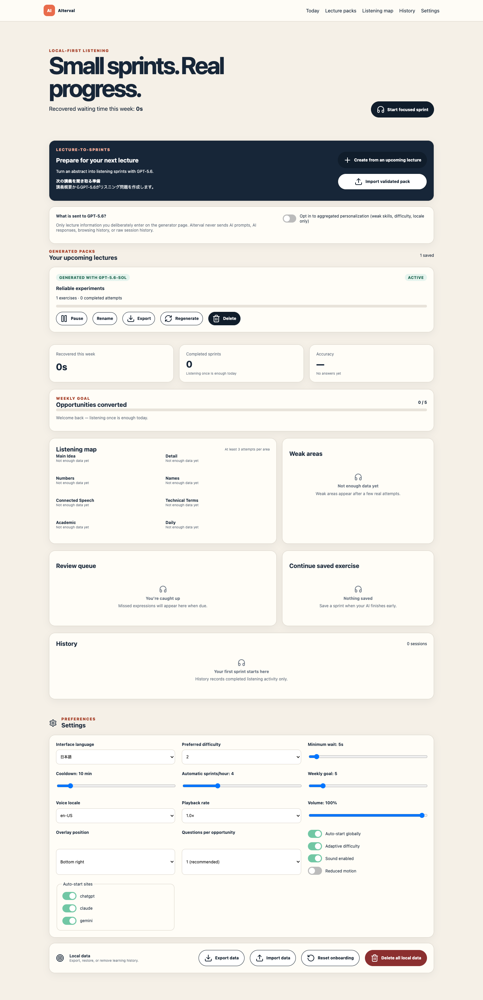
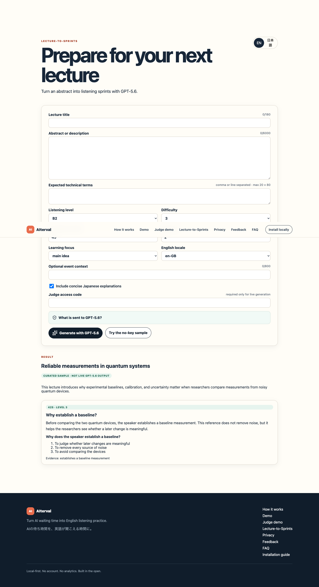
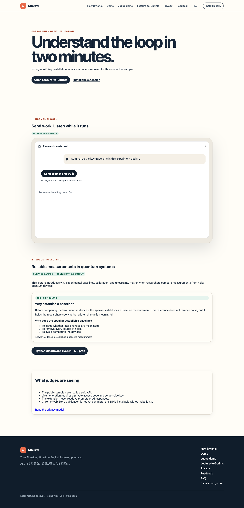

# AIterval

> Turn AI waiting time into English listening practice.

> AIの待ち時間を、英語が聞こえる時間に。

AIterval is a local-first Chrome extension that turns the short wait after a prompt to ChatGPT, Claude, or Gemini into one 15–90 second English listening sprint. When the AI finishes, audio pauses and the user returns to work.




## OpenAI Build Week

AIterval 0.2.0 is the Education-track Build Week edition. It was created with Codex and meaningfully uses GPT-5.6 through the server-side OpenAI Responses API and Structured Outputs. The first repository commit is dated July 18, 2026, within the official July 13–21 Submission Period; [docs/build-week.md](docs/build-week.md) records the unmodified Git evidence.

- Public no-login judge demo: <https://aiterval-build-week.vercel.app/demo/judge>
- Lecture-to-Sprints: <https://aiterval-build-week.vercel.app/lecture>
- Public source repository: <https://github.com/dorakingx/aiterval>
- Submission track: **Education**

Live generation and sample mode are deliberately distinct. Sample mode is public, free, and labeled as curated sample data. Live GPT-5.6 generation runs only when the deployment has a server-side `OPENAI_API_KEY`, a GPT-5.6-family `OPENAI_MODEL`, and a private `DEMO_ACCESS_CODE`.

## The problem

At an international summer school, the creator struggled to understand lectures and conversations in English while having little dedicated study time. At the same time, AI tools repeatedly created short waits inside normal work.

## The insight

AIterval connects those two problems: instead of asking a busy researcher to create more study time, it converts time already lost to AI generation into a sustainable listening habit.

## How AIterval works

```text
Upcoming lecture or technical topic
→ GPT-5.6 creates schema-validated listening exercises
→ user sends normal work to ChatGPT, Codex, Claude, or Gemini
→ AIterval starts one personalized sprint during the wait
→ AI work finishes and listening pauses
→ user returns immediately to work
```

The extension observes only generation-state controls. It never reads prompt or response content. Built-in exercises, wait detection, speech synthesis, progress, review scheduling, and the 132-exercise library remain local and need no OpenAI API key.

## Lecture-to-Sprints with GPT-5.6

The user deliberately enters an upcoming lecture title, abstract, expected terms, level, difficulty, duration, focus, and locale. A server-only endpoint calls the OpenAI Responses API with `gpt-5.6` by default, applies Structured Outputs from the same Zod schema used by runtime and import validation, and rejects malformed content. One corrective schema retry is allowed; requests are timed out, rate-limited, quota-bounded, and never logged with their abstract.



Generated packs include model, generation timestamp, lecture title, and schema provenance. The web app exports a validated pack; the extension validates it again, stores it locally, prioritizes it during future waits, and lets the user pause, rename, export, regenerate, or delete it. This safer import flow adds no extension network host permission and leaves the existing extension CSP unchanged.

## How Codex was used

The majority of core implementation and this GPT-5.6 upgrade were produced in one primary Codex task. Codex translated the product brief into the monorepo architecture, isolated wait-state adapters, state machine, schemas, React UX, security boundaries, tests, deployment configuration, and submission evidence. It also ran real Chromium extension tests, diagnosed build/deployment failures, and verified artifacts. The creator supplied the lived problem, requirements, product priorities, privacy constraints, and final submission direction. See [docs/codex-collaboration.md](docs/codex-collaboration.md).

## Human decisions

The creator chose the international-lecture problem, the “one question during a wait” interaction, immediate interruption when AI finishes, local-first history, no punitive daily streak, Chrome as the first platform, the Education track, and the decision that prompts and responses must never be inspected. Codex implemented and tested those decisions; it did not invent user-test results, testimonials, or usage claims.

## What is included

- Semantic wait-state adapters for ChatGPT, Claude, and Gemini
- Manual start from popup, context menu, or `Command+Shift+L` (`Ctrl+Shift+L` on Windows/Linux)
- Isolated Shadow DOM overlay with listen, answer, feedback, AI-ready interruption, save, and dismiss flows
- Browser speech synthesis with real installed English voice discovery and graceful fallback
- 132 original, runtime-validated listening exercises across academic, conversational, and technical topics
- Deterministic local recommendation, lightweight review scheduling, cooldowns, and honest recovered-time metrics
- Full onboarding, popup, local-data dashboard, import/export, and confirmed deletion
- English/Japanese product copy and a responsive multi-page Next.js site with an interactive extension demo
- Lecture-to-Sprints with GPT-5.6, server-side access control, sample fallback, and generated-pack scheduling
- Vitest, Testing Library, Playwright fixtures, GitHub CI, and tagged release builds

## Privacy model

AIterval observes generation-state interface signals only. It never reads, stores, transmits, or logs prompt or response content. Core listening and progress are local-first; built-in exercises work without an API key. The only external AI call occurs after the user explicitly submits lecture information for generation. Only that deliberate lecture input and learning preferences are sent to OpenAI. There is no analytics SDK, advertising SDK, tracking pixel, or remote executable code. Learning data and generated packs remain in extension storage and can be exported or deleted.

See [docs/privacy.md](docs/privacy.md) for the exact data and permission model.

## Judge quick start



1. Open the [public judge demo](https://aiterval-build-week.vercel.app/demo/judge); no login or code is required.
2. Select **Send prompt and try it**, listen, answer once, and observe the AI-ready interruption and recovered-time update.
3. Open [Lecture-to-Sprints](https://aiterval-build-week.vercel.app/lecture) and choose **Try the no-key sample**.
4. For the packaged extension, download the `v0.2.0` release ZIP, load its unpacked directory from `chrome://extensions`, and follow [docs/judge-testing-guide.md](docs/judge-testing-guide.md).

The private live-generation access code belongs only in the Devpost testing instructions. It is never committed. Chrome Web Store publication is not complete.
The primary Codex task `/feedback` Session ID is also submitted privately through Devpost and is never published in this repository, screenshots, client bundles, or the demo video.

## What was built during the Submission Period

The repository has no commits before July 18, 2026. The initial extension, web app, local exercise system, tests, private deployment, GPT-5.6 Lecture-to-Sprints upgrade, judge demo, and submission assets were all created during the official Submission Period. Exact commit times and links are in [docs/build-week.md](docs/build-week.md).

## Architecture

This pnpm workspace contains:

```text
apps/extension  WXT + React, Chrome Manifest V3
apps/web        Next.js App Router marketing site and interactive demo
packages/core   State machine, scheduling, rules, statistics, typed storage
packages/content  Runtime-validated exercise bank
packages/ui     Shared React components, listening player, audio provider, tokens
packages/config Shared strict TypeScript configuration
```

Detailed design: [docs/architecture.md](docs/architecture.md).

## Prerequisites on macOS

1. Install Node.js 20.19 or newer (Node 22 LTS is recommended).
2. Enable pnpm with `corepack enable`.
3. Install Google Chrome.
4. Optional for E2E: install Playwright Chromium with `pnpm exec playwright install chromium`.

No environment variables are required for the extension, sample demo, or built-in exercises. Live generation uses server-only variables:

```bash
OPENAI_API_KEY=...          # never expose to the browser
OPENAI_MODEL=gpt-5.6       # or gpt-5.6-sol/terra/luna only
DEMO_ACCESS_CODE=...       # judge code, never commit
DEMO_DAILY_QUOTA=30        # optional best-effort demo quota
```

## Install and develop

```bash
git clone <repository-url>
cd aiterval
pnpm install
pnpm dev:extension
```

In another terminal, start the web app:

```bash
pnpm dev:web
```

Open [http://localhost:3000](http://localhost:3000).

## Load the unpacked extension

1. Run `pnpm build`.
2. Open `chrome://extensions` in Chrome.
3. Enable **Developer mode**.
4. Select **Load unpacked**.
5. Choose the verified output directory: `apps/extension/.output/chrome-mv3`.

For development, WXT writes a development build under `apps/extension/.output/chrome-mv3-dev` after `pnpm dev:extension` starts.

## Quality commands

```bash
pnpm lint
pnpm typecheck
pnpm test
pnpm test:e2e
pnpm test:gpt56:smoke
pnpm build
pnpm build:web-worker
pnpm zip:extension
pnpm check
```

`pnpm check` runs the required quality suite, including browser E2E. The E2E suite loads the built extension and routes the three real supported hostnames to local semantic-state fixtures, so no AI account is needed. API tests mock the OpenAI SDK and never make paid calls. `pnpm test:gpt56:smoke` makes one real request only when `OPENAI_API_KEY` exists and otherwise prints an honest skip. See [docs/testing.md](docs/testing.md).

## Testing

Coverage includes canonical output/input schemas, storage migration, provenance, aggregated personalization, generated scheduling, rate/quota decisions, access-code enforcement, prompt injection, timeout/error mapping, web form states, bilingual UI, pack deletion, all three AI adapters, duplicate-overlay prevention, keyboard access, and the complete no-login judge flow.

## Deployment

The public Next.js deployment runs on the already-authenticated Vercel account and exposes static sample pages plus the server-side generation route. An earlier owner-only Sites deployment is retained, but its private URL is intentionally omitted. Production secrets are configured only in the hosting provider. If the API key or access code is absent, live generation returns a safe unavailable response and the sample remains usable.

## How wait detection works

Each supported site has an isolated adapter implementing `AIWaitAdapter`. A debounced `MutationObserver` watches a narrow attribute set and combines accessible stop/cancel labels, `aria-busy`, and site-specific stable signals. The shared controller handles thresholds, cooldown, completion, SPA navigation, and duplicate prevention. It never accesses conversation containers or text.

Automatic detection can fail when a third-party interface changes; the keyboard shortcut, popup, and context menu remain available. Signal details live in [docs/architecture.md](docs/architecture.md).

## Add a new AI-site adapter

1. Add an isolated file under `apps/extension/lib/adapters/`.
2. Implement `id`, `hostnamePatterns`, `detectState`, and `observe`.
3. Use semantic control attributes, debounce mutations, and never inspect conversation text.
4. Export the adapter from `adapters/index.ts`.
5. Add the narrow host permission and a local fixture.
6. Extend E2E coverage for start, completion, duplicates, and SPA navigation.

## Add listening exercises

Edit `packages/content/src/index.ts` or add a new original content module that exports `ListeningExercise` values. Every item must pass `exerciseSchema`; run `pnpm test` to check IDs, answers, indexes, durations, tags, questions, and transcript uniqueness. Do not copy textbook, podcast, course, movie, lecture, or other copyrighted material.

## Build, ZIP, and release

```bash
pnpm build
pnpm zip:extension
```

The unpacked build is `apps/extension/.output/chrome-mv3`. WXT writes the distributable ZIP to `apps/extension/.output/aitervalextension-0.2.0-chrome.zip`.

To publish a GitHub release, update the version, commit, then push a `v*` tag. `.github/workflows/release.yml` builds the extension, creates a ZIP and SHA-256 checksum, and uploads both to the release. It does not publish to the Chrome Web Store.

## Known limitations

- Third-party AI interfaces change; semantic detection is resilient but cannot be guaranteed. Manual start is always available.
- Speech quality and available accents depend on system-installed voices. AIterval does not claim an accent is available unless the browser reports it.
- Static recorded audio, microphone scoring, accounts, syncing, telemetry, and Chrome Web Store publishing are outside the MVP.
- Live lecture generation requires separately supplied OpenAI API credentials and a private demo access code; public sample mode remains available without either.
- The detailed local history retains the most recent 500 sessions; aggregate totals remain available.

## Contributing and security

See [CONTRIBUTING.md](CONTRIBUTING.md), [SECURITY.md](SECURITY.md), and [LICENSE](LICENSE).
